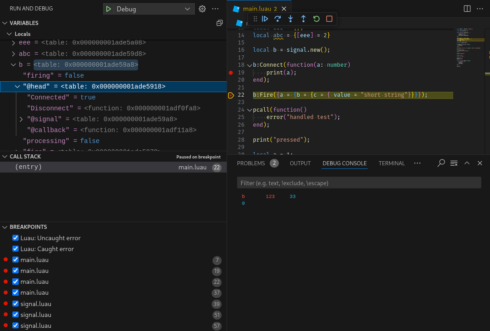

# ZUNE Debugger VSCode
A debugger for [Luau](https://luau.org), powered by [zune (0.5+)](https://github.com/Scythe-Technology/zune).

## Features
- Basic debugging capabilities(breakpoints, step over, step into, step out).
- Variable inspection (locals, upvalues, globals, parameters w/ varargs).
- Handled and unhandled exception breakpoints.
- Call stack inspection.

## Configuration Options
- `program`: `string` (required)
  -  luau/lua script to run (i.e. `${workspaceFolder}/main.luau`)
- `stopOnEntry`: `boolean` (default: `false`)
  -  Enter breakpoint before running the script.
- `cwd`: `string` (default: `${workspaceFolder}`)
  -  Working directory of the script.
- `args`: `array` (default: `[]`)
  -  Arguments to pass to the script.
- `debuggerPath`: `string` (default: `zune`)
  -  Path to the debugger executable. If not specified, it will use the `zune` executable in your PATH.
- `debuggerArgs`: `array` (default: `[]`)
  -  Arguments to pass to the debugger.
